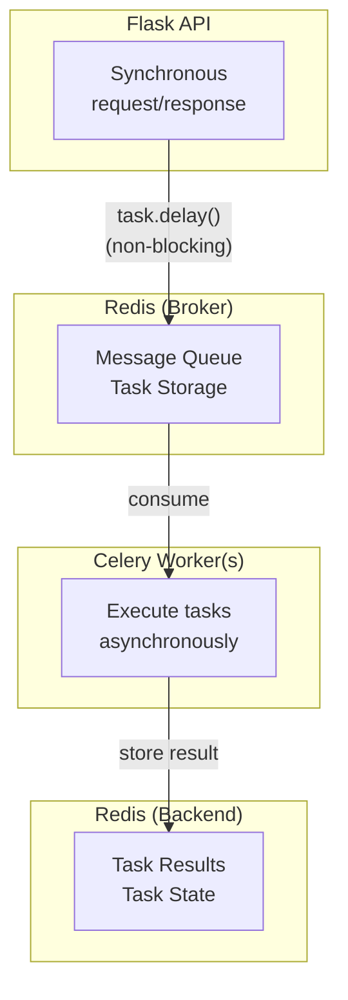
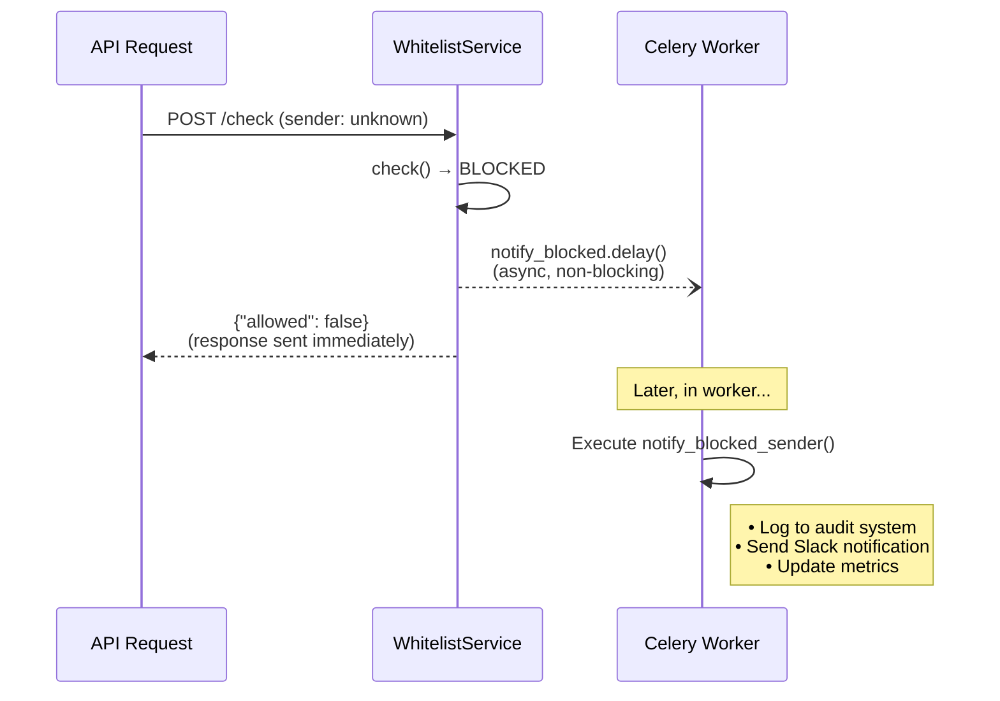
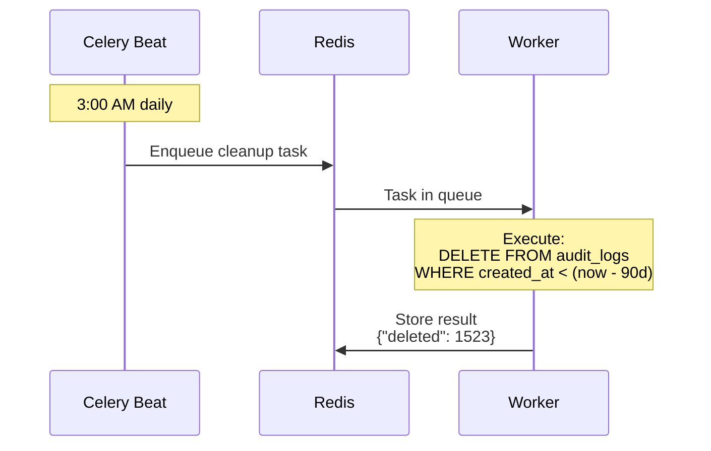
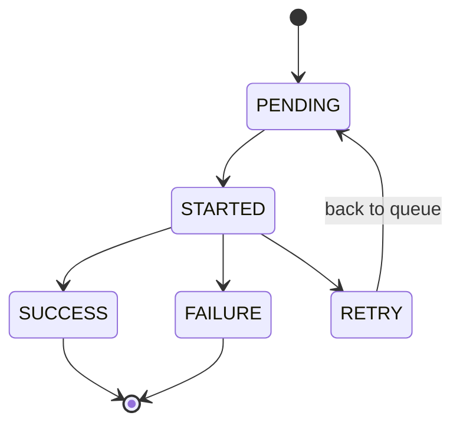
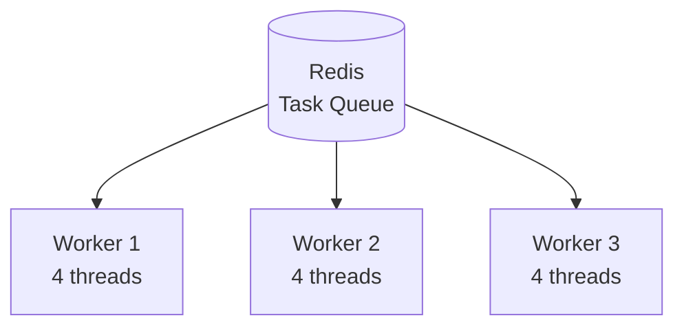

# Async Architecture

> Event-driven design with Celery and Redis

## Overview

WAASP uses Celery for asynchronous task processing, enabling:
- Non-blocking API responses
- Reliable background processing
- Scheduled maintenance tasks
- Horizontal scaling of workers

---

## Architecture



---

## Task Types

### 1. Fire-and-Forget Tasks

Tasks where we don't need the result:

```python
# Notify admin when sender is blocked
@celery_app.task
def notify_blocked_sender(sender_id: str, channel: str | None = None):
    """Send notification about blocked sender."""
    logger.info("blocked_sender_notification", sender_id=sender_id)
    # Send to Slack, email, etc.
```

**Usage:**
```python
# In WhitelistService.check()
if not result.allowed:
    notify_blocked_sender.delay(sender_id, channel)  # Fire and forget
```

### 2. Retriable Tasks

Tasks with automatic retry on failure:

```python
@celery_app.task(bind=True, max_retries=3)
def send_webhook(self, url: str, payload: dict):
    """Send webhook with retry logic."""
    try:
        response = requests.post(url, json=payload, timeout=10)
        response.raise_for_status()
    except requests.RequestException as exc:
        # Exponential backoff: 60s, 120s, 240s
        raise self.retry(exc=exc, countdown=60 * (2 ** self.request.retries))
```

### 3. Scheduled Tasks

Periodic tasks via Celery Beat:

```python
# In celery configuration
celery_app.conf.beat_schedule = {
    'cleanup-old-audit-logs': {
        'task': 'waasp.tasks.cleanup_old_audit_logs',
        'schedule': crontab(hour=3, minute=0),  # Daily at 3 AM
        'args': (90,),  # Keep 90 days
    },
    'aggregate-hourly-stats': {
        'task': 'waasp.tasks.aggregate_audit_stats',
        'schedule': crontab(minute=0),  # Every hour
        'args': ('hourly',),
    },
}
```

---

## Task Flow Diagrams

### Blocked Sender Notification



### Audit Log Cleanup



---

## Configuration

### Celery Configuration

```python
# waasp/tasks/__init__.py

celery_app = Celery("waasp")

celery_app.conf.update(
    # Serialization
    task_serializer="json",
    accept_content=["json"],
    result_serializer="json",
    
    # Timezone
    timezone="UTC",
    enable_utc=True,
    
    # Reliability
    task_track_started=True,
    task_acks_late=True,  # Ack after completion
    worker_prefetch_multiplier=1,  # Fair distribution
    
    # Results
    result_expires=3600,  # 1 hour
    
    # Retry defaults
    task_default_retry_delay=60,
    task_max_retries=3,
)
```

### Redis Configuration

```yaml
# docker-compose.yml
redis:
  image: redis:7-alpine
  ports:
    - "6379:6379"
  volumes:
    - redis_data:/data
  command: redis-server --appendonly yes  # Persistence
```

**Connection URLs:**
```
REDIS_URL=redis://localhost:6379/0          # Broker (task queue)
CELERY_RESULT_BACKEND=redis://localhost:6379/1  # Results (separate DB)
```

---

## Worker Management

### Starting Workers

```bash
# Single worker (development)
celery -A waasp.tasks worker --loglevel=info

# Multiple workers (production)
celery -A waasp.tasks worker --concurrency=4 --loglevel=warning

# With specific queues
celery -A waasp.tasks worker -Q default,notifications --loglevel=info
```

### Starting Beat (Scheduler)

```bash
celery -A waasp.tasks beat --loglevel=info
```

### Docker Compose

```yaml
worker:
  build: .
  command: celery -A waasp.tasks worker --loglevel=info
  depends_on:
    - redis
    - db

beat:
  build: .
  command: celery -A waasp.tasks beat --loglevel=info
  depends_on:
    - redis
```

---

## Monitoring

### Flower (Celery Monitor)

```bash
pip install flower
celery -A waasp.tasks flower --port=5555
```

Access at http://localhost:5555

### Task States



### Structured Logging

```python
import structlog

logger = structlog.get_logger()

@celery_app.task(bind=True)
def example_task(self, data: dict):
    log = logger.bind(task_id=self.request.id)
    
    log.info("task_started", data=data)
    
    try:
        result = process(data)
        log.info("task_completed", result=result)
        return result
    except Exception as e:
        log.error("task_failed", error=str(e))
        raise
```

---

## Error Handling

### Retry with Backoff

```python
@celery_app.task(bind=True, max_retries=5)
def unreliable_task(self, data: dict):
    try:
        return external_api_call(data)
    except TemporaryError as exc:
        # Exponential backoff: 1m, 2m, 4m, 8m, 16m
        countdown = 60 * (2 ** self.request.retries)
        raise self.retry(exc=exc, countdown=countdown)
    except PermanentError:
        # Don't retry permanent failures
        logger.error("permanent_failure", data=data)
        return {"status": "failed", "reason": "permanent"}
```

### Dead Letter Queue

For tasks that fail all retries:

```python
@celery_app.task(bind=True, max_retries=3)
def task_with_dlq(self, data: dict):
    try:
        return process(data)
    except Exception as exc:
        if self.request.retries >= self.max_retries:
            # Send to dead letter queue for manual review
            send_to_dlq.delay({
                "task": "task_with_dlq",
                "data": data,
                "error": str(exc),
                "timestamp": datetime.utcnow().isoformat(),
            })
            return {"status": "sent_to_dlq"}
        raise self.retry(exc=exc)
```

---

## Scaling

### Horizontal Scaling



### Queue Prioritization

```python
# High-priority queue for notifications
celery_app.conf.task_routes = {
    'waasp.tasks.notify_*': {'queue': 'high'},
    'waasp.tasks.cleanup_*': {'queue': 'low'},
    '*': {'queue': 'default'},
}

# Start workers per queue
# celery -A waasp.tasks worker -Q high --concurrency=4
# celery -A waasp.tasks worker -Q default,low --concurrency=2
```

---

*Async architecture documentation for WAASP v0.1.0*
