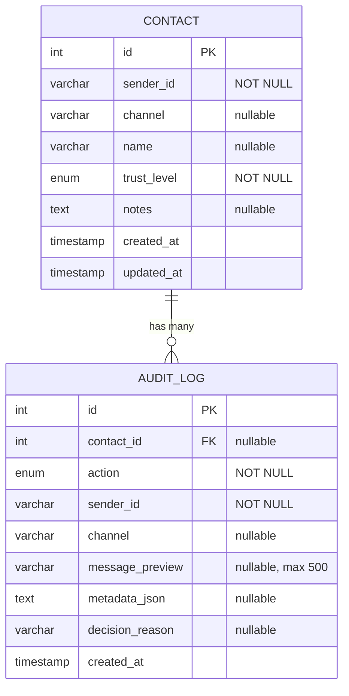
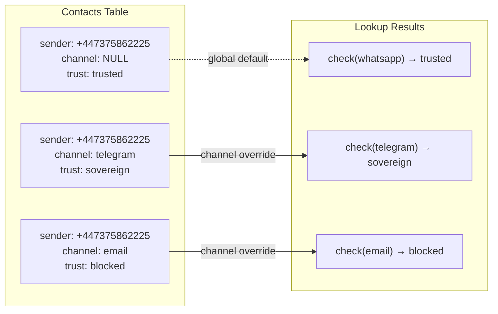
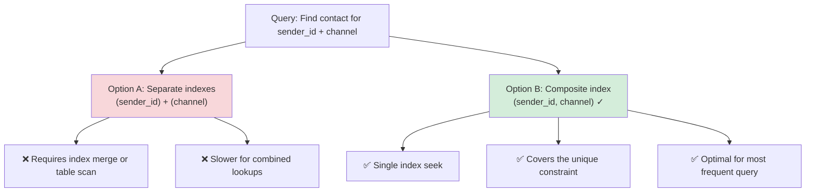

# Data Model

> Database schema design and relationships for WAASP

## Entity Relationship Diagram



**Indexes:**
- `CONTACT`: `(sender_id, channel) UNIQUE`, `(sender_id)`, `(channel)`
- `AUDIT_LOG`: `(sender_id, created_at)`, `(action, created_at)`, `(contact_id)`

---

## Contact Table

The `contacts` table is the core of the whitelist system.

### Schema

```sql
CREATE TABLE contacts (
    id              INTEGER PRIMARY KEY AUTOINCREMENT,
    sender_id       VARCHAR(255) NOT NULL,
    channel         VARCHAR(50),
    name            VARCHAR(255),
    trust_level     VARCHAR(20) NOT NULL DEFAULT 'blocked',
    notes           TEXT,
    created_at      TIMESTAMP DEFAULT CURRENT_TIMESTAMP,
    updated_at      TIMESTAMP DEFAULT CURRENT_TIMESTAMP,
    
    CONSTRAINT uq_contacts_sender_channel UNIQUE (sender_id, channel)
);

CREATE INDEX ix_contacts_sender_id ON contacts(sender_id);
CREATE INDEX ix_contacts_channel ON contacts(channel);
```

### Columns

| Column | Type | Nullable | Description |
|--------|------|----------|-------------|
| `id` | INTEGER | No | Primary key, auto-increment |
| `sender_id` | VARCHAR(255) | No | Unique identifier (phone, user ID, etc.) |
| `channel` | VARCHAR(50) | Yes | Channel scope. NULL = all channels |
| `name` | VARCHAR(255) | Yes | Human-readable display name |
| `trust_level` | ENUM | No | One of: sovereign, trusted, limited, blocked |
| `notes` | TEXT | Yes | Admin notes about this contact |
| `created_at` | TIMESTAMP | No | Record creation time (UTC) |
| `updated_at` | TIMESTAMP | No | Last modification time (UTC) |

### Trust Level Enum

```python
class TrustLevel(str, Enum):
    SOVEREIGN = "sovereign"  # Full access, can modify whitelist
    TRUSTED = "trusted"      # Can trigger agent actions
    LIMITED = "limited"      # Agent sees but can't act
    BLOCKED = "blocked"      # Never reaches agent
```

### Unique Constraint Strategy

The composite unique constraint on `(sender_id, channel)` enables:

1. **Global contacts** (channel = NULL): Apply to all channels
2. **Channel-specific contacts**: Override global for specific channel



| sender_id | channel | trust | note |
|-----------|---------|-------|------|
| +447375862225 | NULL | trusted | Global default |
| +447375862225 | telegram | sovereign | Channel override |
| +447375862225 | email | blocked | Channel override |

---

## AuditLog Table

Every whitelist decision is logged for security analysis.

### Schema

```sql
CREATE TABLE audit_logs (
    id              INTEGER PRIMARY KEY AUTOINCREMENT,
    action          VARCHAR(20) NOT NULL,
    sender_id       VARCHAR(255) NOT NULL,
    channel         VARCHAR(50),
    contact_id      INTEGER REFERENCES contacts(id) ON DELETE SET NULL,
    message_preview VARCHAR(500),
    metadata_json   TEXT,
    decision_reason VARCHAR(255),
    created_at      TIMESTAMP DEFAULT CURRENT_TIMESTAMP
);

CREATE INDEX ix_audit_logs_sender_created ON audit_logs(sender_id, created_at);
CREATE INDEX ix_audit_logs_action_created ON audit_logs(action, created_at);
```

### Columns

| Column | Type | Nullable | Description |
|--------|------|----------|-------------|
| `id` | INTEGER | No | Primary key |
| `action` | ENUM | No | Type of action (allowed, blocked, etc.) |
| `sender_id` | VARCHAR(255) | No | Sender that triggered this log |
| `channel` | VARCHAR(50) | Yes | Channel context |
| `contact_id` | INTEGER | Yes | FK to contact (if exists). SET NULL on delete |
| `message_preview` | VARCHAR(500) | Yes | Truncated message content for debugging |
| `metadata_json` | TEXT | Yes | Additional context as JSON |
| `decision_reason` | VARCHAR(255) | Yes | Human-readable reason |
| `created_at` | TIMESTAMP | No | When the action occurred (UTC) |

### Action Enum

```python
class AuditAction(str, Enum):
    # Decision actions
    ALLOWED = "allowed"
    BLOCKED = "blocked"
    LIMITED = "limited"
    
    # Administrative actions
    CONTACT_ADDED = "contact_added"
    CONTACT_UPDATED = "contact_updated"
    CONTACT_REMOVED = "contact_removed"
    TRUST_CHANGED = "trust_changed"
    
    # System events
    CHECK_PERFORMED = "check_performed"
    API_ACCESS = "api_access"
```

### Foreign Key Strategy

The `contact_id` FK uses `ON DELETE SET NULL` because:
1. Audit logs should persist even if a contact is removed
2. Historical records remain queryable
3. We can still see that a check was made, even if the contact no longer exists

---

## Indexing Strategy

### Primary Access Patterns

| Query | Index Used | Frequency |
|-------|------------|-----------|
| Check sender by ID + channel | `ix_contacts_sender_channel` | Very High |
| Check sender by ID (global) | `ix_contacts_sender_id` | High |
| List contacts by channel | `ix_contacts_channel` | Medium |
| Audit logs by sender | `ix_audit_logs_sender_created` | Medium |
| Audit logs by action type | `ix_audit_logs_action_created` | Low |

### Index Design Rationale



---

## Migration Strategy

### Initial Migration

```python
# migrations/versions/001_initial.py

def upgrade():
    op.create_table(
        'contacts',
        sa.Column('id', sa.Integer(), primary_key=True),
        sa.Column('sender_id', sa.String(255), nullable=False),
        sa.Column('channel', sa.String(50), nullable=True),
        sa.Column('name', sa.String(255), nullable=True),
        sa.Column('trust_level', sa.String(20), nullable=False, default='blocked'),
        sa.Column('notes', sa.Text(), nullable=True),
        sa.Column('created_at', sa.DateTime(), nullable=False),
        sa.Column('updated_at', sa.DateTime(), nullable=False),
    )
    
    op.create_index('ix_contacts_sender_channel', 'contacts', 
                    ['sender_id', 'channel'], unique=True)
    
    # ... audit_logs table
```

### Adding New Fields

When adding fields, always:
1. Make them nullable OR provide a default
2. Add index if it will be queried
3. Consider backfill for existing records

```python
# Example: Adding a 'last_seen' field
def upgrade():
    op.add_column('contacts', 
        sa.Column('last_seen', sa.DateTime(), nullable=True))

def downgrade():
    op.drop_column('contacts', 'last_seen')
```

---

## Query Patterns

### Frequent Queries

```python
# 1. Check sender (most common)
Contact.query.filter_by(sender_id=sender_id, channel=channel).first()

# 2. List all trusted contacts
Contact.query.filter(Contact.trust_level == TrustLevel.TRUSTED).all()

# 3. Recent audit logs for a sender
AuditLog.query.filter_by(sender_id=sender_id)\
    .order_by(AuditLog.created_at.desc())\
    .limit(100).all()

# 4. Audit statistics
db.session.query(AuditLog.action, func.count(AuditLog.id))\
    .group_by(AuditLog.action).all()
```

### Avoiding N+1 Queries

```python
# Bad: N+1 when accessing contact for each log
logs = AuditLog.query.all()
for log in logs:
    print(log.contact.name)  # Triggers query per log!

# Good: Eager load relationships
logs = AuditLog.query.options(joinedload(AuditLog.contact)).all()
for log in logs:
    print(log.contact.name)  # Already loaded
```

---

## Data Retention

### Audit Log Cleanup

```python
# Celery task: Clean logs older than 90 days
@celery_app.task
def cleanup_old_audit_logs(days: int = 90):
    cutoff = datetime.now(timezone.utc) - timedelta(days=days)
    deleted = AuditLog.query.filter(AuditLog.created_at < cutoff).delete()
    db.session.commit()
    return {"deleted": deleted}
```

### Soft Delete Option

For compliance requirements, consider soft delete:

```python
class Contact(Base):
    # ... existing fields
    deleted_at: Mapped[datetime | None] = mapped_column(nullable=True)
    
    @property
    def is_deleted(self) -> bool:
        return self.deleted_at is not None
```

---

*Data model documentation for WAASP v0.1.0*
