# Security Model

> Trust levels, threat model, and security architecture for WAASP

## Overview

WAASP operates on a simple principle: **untrusted by default, explicitly whitelisted**.

This document covers:
1. Trust levels and their implications
2. Threat model
3. Authentication and authorization
4. Security boundaries
5. Known limitations

---

## Trust Levels

```mermaid
flowchart TB
    subgraph TH["Trust Hierarchy"]
        direction TB
        S["🔑 SOVEREIGN<br/>Full access + Admin rights"]
        T["✅ TRUSTED<br/>Agent actions enabled"]
        L["👁️ LIMITED<br/>Read-only, no actions"]
        B["🚫 BLOCKED<br/>No access (logged)"]
        
        S --> T --> L --> B
    end
    
    style S fill:#28a745,color:#fff
    style T fill:#17a2b8,color:#fff
    style L fill:#ffc107,color:#000
    style B fill:#dc3545,color:#fff
```



### Sovereign

**Who:** The agent owner (you)

**Capabilities:**
- All agent interactions allowed
- Can trigger any action
- Can modify the whitelist via API
- Full audit log access

**Typical assignment:**
- Your primary phone number
- Your primary email

```python
waasp add "+447375862225" --name "Me" --trust sovereign
```

### Trusted

**Who:** Friends, family, close colleagues

**Capabilities:**
- Can send messages to agent
- Can trigger agent actions (send emails, execute commands, etc.)
- Cannot modify whitelist

**Typical assignment:**
- Family members
- Trusted colleagues
- Automated systems you control

```python
waasp add "+441234567890" --name "Partner" --trust trusted
```

### Limited

**Who:** Acquaintances, services, low-trust contacts

**Capabilities:**
- Messages reach the agent
- Agent can read and respond
- Cannot trigger actions (agent will refuse)
- Useful for information queries only

**Typical assignment:**
- Service notifications
- Casual contacts
- Public-facing interfaces

```python
waasp add "+449876543210" --name "Newsletter Bot" --trust limited
```

### Blocked

**Who:** Everyone else (default)

**Capabilities:**
- Messages never reach agent
- Logged for audit/analysis
- Can be explicitly set for known bad actors

**Typical assignment:**
- Unknown senders (automatic)
- Known spammers
- Former trusted contacts (revoked)

---

## Threat Model

### In-Scope Threats

| Threat | Description | Mitigation |
|--------|-------------|------------|
| **Prompt injection from strangers** | Malicious input in messages | Block unknown senders |
| **Social engineering** | Pretending to be someone else | Platform-verified identity |
| **Spam/abuse** | High-volume unwanted messages | Default block + rate limiting |
| **Data exfiltration attempts** | Tricking agent to reveal info | Trust-based action gating |

### Out-of-Scope Threats

| Threat | Why Out of Scope |
|--------|------------------|
| **Compromised trusted contact** | WAASP trusts the person, not just the phone |
| **Platform vulnerabilities** | WhatsApp/Telegram security is their responsibility |
| **Physical device access** | If they have your phone, WAASP isn't your problem |
| **Nation-state attackers** | Beyond the threat model of a personal assistant |
| **Zero-day exploits in WAASP** | Report via responsible disclosure |

### Trust Boundaries

```mermaid
flowchart TB
    subgraph Untrusted["🌐 UNTRUSTED ZONE"]
        WA[WhatsApp<br/>Messages]
        TG[Telegram<br/>Messages]
        EM[Email<br/>Messages]
    end
    
    subgraph Auth["Platform Authentication"]
        PA[Verified sender identity]
    end
    
    subgraph WAASP["🛡️ WAASP TRUST BOUNDARY"]
        direction LR
        IN["Input:<br/>sender_id + channel + message"]
        OUT["Output:<br/>allow | block | limit"]
        IN --> OUT
    end
    
    subgraph Trusted["✅ TRUSTED ZONE"]
        Agent["🤖 AI Agent<br/>Only sees allowed messages"]
    end
    
    WA & TG & EM --> PA
    PA --> WAASP
    WAASP --> Agent
    
    style Untrusted fill:#ffcccc
    style WAASP fill:#fff3cd,stroke:#856404,stroke-width:3px
    style Trusted fill:#d4edda
```



---

## Authentication & Authorization

### API Authentication

Admin endpoints require Bearer token authentication:

```bash
# Set token
export WAASP_API_TOKEN="your-secret-token"

# Authenticated request
curl -H "Authorization: Bearer your-secret-token" \
     http://localhost:8000/api/v1/contacts/
```

### Authentication Bypass (Development)

For local development, localhost requests bypass authentication:

```python
# In waasp/api/auth.py
if request.remote_addr in ("127.0.0.1", "::1", "localhost"):
    return f(*args, **kwargs)  # Allow without token
```

### Authorization Matrix

| Endpoint | Sovereign | Trusted | Limited | Blocked | Unauthenticated |
|----------|-----------|---------|---------|---------|-----------------|
| `POST /check` | ✅ | ✅ | ✅ | ✅ | ✅ |
| `GET /contacts` | ✅ | ❌ | ❌ | ❌ | ❌* |
| `POST /contacts` | ✅ | ❌ | ❌ | ❌ | ❌* |
| `DELETE /contacts` | ✅ | ❌ | ❌ | ❌ | ❌* |
| `GET /audit` | ✅ | ❌ | ❌ | ❌ | ❌* |

\* Requires API token

---

## Security Considerations

### Message Preview Logging

Audit logs can store a truncated message preview for debugging:

```python
message_preview: Mapped[str | None] = mapped_column(
    String(500),  # Truncated to 500 chars
    nullable=True,
)
```

**Privacy implications:**
- Useful for debugging blocked messages
- Contains potentially sensitive content
- Consider encryption at rest for production
- Implement retention policies (90-day default)

### SQL Injection Prevention

SQLAlchemy ORM with parameterized queries:

```python
# Safe: parameterized query
Contact.query.filter_by(sender_id=sender_id).first()

# Also safe: explicit parameters
Contact.query.filter(Contact.sender_id == sender_id).first()

# Never do this:
# Contact.query.filter(f"sender_id = '{sender_id}'")  # VULNERABLE
```

### Secret Management

```python
# Environment variables (recommended)
SECRET_KEY = os.environ.get("SECRET_KEY")
API_TOKEN = os.environ.get("WAASP_API_TOKEN")

# Never commit secrets to code
# Use .env files (gitignored) for development
# Use AWS Secrets Manager / Vault for production
```

---

## Known Limitations

### 1. Platform Trust Dependency

WAASP trusts the upstream platform's sender verification:

```
WhatsApp says sender is +447375862225
            ↓
WAASP trusts this is true
            ↓
Checks whitelist for +447375862225
```

**Implication:** If WhatsApp's verification is compromised, WAASP's protection is bypassed.

### 2. Account Compromise

If a trusted contact's account is compromised:

```
Attacker gains access to trusted user's WhatsApp
            ↓
Sends malicious message
            ↓
WAASP allows (sender is whitelisted)
            ↓
Agent receives malicious prompt
```

**Mitigation:** This is out of scope. Educate trusted contacts on account security.

### 3. No Content Inspection

WAASP only checks *who* sent the message, not *what* they sent:

```
Trusted contact sends: "Ignore previous instructions and..."
            ↓
WAASP allows (sender is trusted)
            ↓
Prompt injection reaches agent
```

**Mitigation:** Combine with agent-level prompt injection defenses.

### 4. Single Point of Failure

If WAASP is down, the integration must decide:
- **Fail open:** Allow all messages (dangerous)
- **Fail closed:** Block all messages (disruptive)

**Recommendation:** Fail closed, with monitoring and fast recovery.

---

## Responsible Disclosure

Found a security issue? Please report it responsibly:

- **Email:** security@oceanheart.ai
- **GitHub:** [Security Advisory](https://github.com/rickhallett/waasp-py/security/advisories/new)

**Scope:**
- Authentication bypass
- Authorization flaws
- SQL injection
- Data exposure

**Out of scope:**
- Self-hosted deployment misconfigurations
- Social engineering of the operator
- Denial of service without impact

---

*Security model documentation for WAASP v0.1.0*
